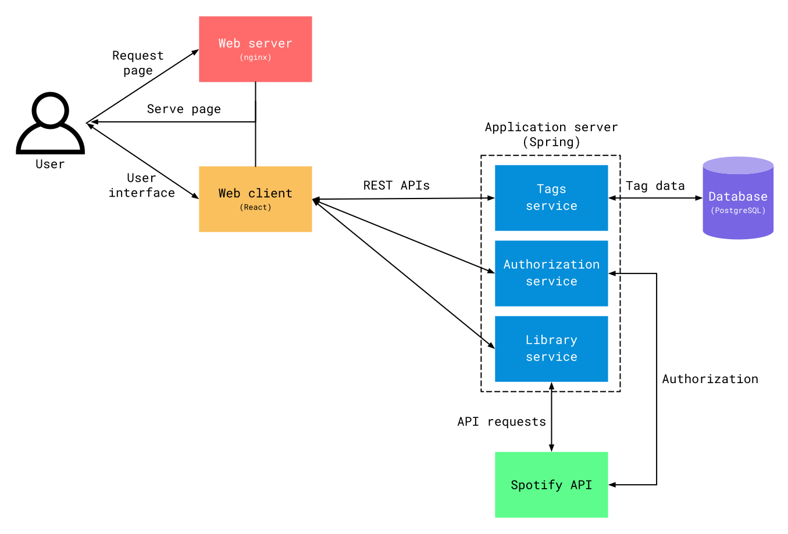

# Dynamic Playlist

Use tags to organize your Spotify library!

#### How is Dynamic Playlist used?

1. Create **tags** — arbitrary labels that can be used to describe some feature of your tracks.<br>_For example, you
   could
   create a tag to describe the genre, language, or mood of a track._
2. Add any number of tags to your tracks.
3. Dynamically generate a playlist based on a combination of tags.
4. Listen to the playlist in your Spotify client!

## Gallery


## Technical details

### Technologies used

- [Application server](app-server) — Kotlin, Spring Boot, MockK
- [Database](db) — PostgreSQL
- [Web client](web-client) — TypeScript, React, Chakra UI, TanStack Query, TanStack Table, TanStack Virtual, Downshift
- [Web server](web-server) — Nginx
- Misc. — Docker

### Architecture



#### Components

- [Application server](app-server) — collection of services that manage business logic and interactions with Spotify Web
  API
    - Tags — manages CRUD operations on tags
    - Authorization — implements
      Spotify [authorization code flow](https://developer.spotify.com/documentation/web-api/tutorials/code-flow)
    - Library — manages Spotify Web API operations e.g. fetching the user's library and generating playlists
- [Database](db) — database for persisting user tag data
- [Web client](web-client) — web user interface
- [Web server](web-server) — serves web client

## Requirements

* [Docker](https://www.docker.com/)
* [npm](https://www.npmjs.com/)
* [Spotify Web API client ID and secret](https://developer.spotify.com/documentation/web-api/concepts/apps)

## Building

1. Build `app-server`

```shell
$ cd app-server
$ ./mvnw package
```

2. Build `web-client`

```shell
$ cd web-client
$ npm install
$ npm run build
```

3. Insert your client ID and secret into `.env`

## Running

To start the application:

```shell
$ docker compose up -d
```

By default, ports `8080`, `5432`, and `8081` will be used.

Connect to the client in a browser at `localhost:8081`.

To stop the application:

```shell
$ docker compose down
```
